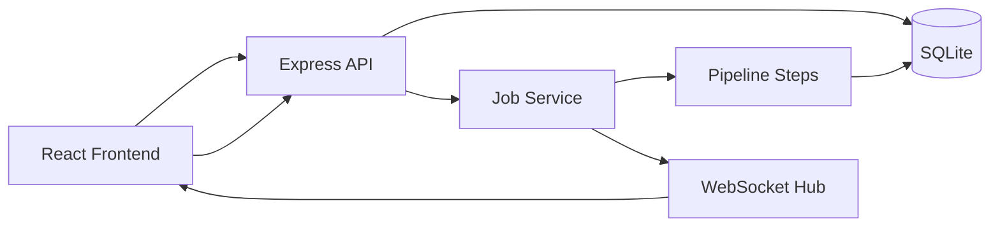

# BlockFlow TT

Full-stack demo with 3-step React flow and job processing via WebSocket or HTTP polling.

## Part 0 - Short Design

### User scenario 1 (WebSocket run)
1. User selects one option on screen 1 and enters a positive number on screen 2.
2. On screen 3 user clicks **Start via WebSocket**.
3. Frontend creates a job (`POST /jobs`), then opens `ws://.../ws?jobId=:id`.
4. User sees live status/progress updates (`queued`, `processing`, `%`, `done/failed`) in real time.

### User scenario 2 (HTTP polling run)
1. User completes screen 1 and 2 similarly.
2. On screen 3 user clicks **Start via HTTP**.
3. Frontend creates a job (`POST /jobs`) and starts polling (`GET /jobs/:id`) every ~1.2s.
4. While running, user sees indeterminate progress bar. When done, mock result is shown.

### How job processing works
- Backend creates job in DB with `queued` and `progress = 0`.
- Background processing starts immediately, moves job to `processing`.
- Pipeline executes 3 sequential step functions with delay simulation.
- After each step, backend updates `status/progress` in DB.
- On success: `done` + mock result. On error: `failed` + error message.

### How status updates work
- **WebSocket mode**: backend broadcasts updates for a specific `jobId` channel (`/ws?jobId=...`).
- **HTTP mode**: frontend polls `GET /jobs/:id`; source of truth is persisted DB state.

### High-level flow


Flow legend:
- UI -> API (create job): `POST /jobs`
- UI -> API (poll status): `GET /jobs/:id`
- UI <-> WS (live updates): `ws://.../ws?jobId=:id`

## Part 1 - Frontend

Implemented in `frontend`:
- Screen 1: 4 options, single selection, Continue enabled after selection.
- Screen 2: numeric input, validation `> 0`, Continue enabled only when valid.
- Screen 3:
  - Start via WebSocket with real-time `%` progress.
  - Start via HTTP with indeterminate progress while polling.
  - Reset button clears progress/state and returns to step 1.

## Part 2 - Backend

Implemented in `backend`:
- `POST /jobs` creates job.
- `GET /jobs/:id` returns current job status.
- Job states: `queued -> processing -> done/failed`.
- WebSocket broadcasts updates per job id.
- SQLite persistence for `id`, `status`, `progress`, `createdAt` (+ result/error fields).
- Pipeline split into separate step functions and designed for easy extension.
- Architecture separation:
  - API (`src/server.ts`)
  - job logic (`src/jobs.ts`)
  - pipeline (`src/pipeline/steps.ts`)
  - database (`src/db.ts`)
  - websocket hub (`src/wsHub.ts`)

## Local run

### Backend
```bash
cd backend
npm install
npm run dev
```

Runs on `http://localhost:4000`.

### Frontend
```bash
cd frontend
npm install
npm run dev
```

Frontend calls backend at `http://localhost:4000` by default.  
Optional override: `VITE_API_BASE_URL=<your-backend-url>`.

## Deployment links

- GitHub repo: `https://github.com/RomanPie2020/test-task-blockflow`
- Frontend (Firebase Hosting): `https://blockflowtt-9e11a.web.app`
- Backend online URL: `https://test-task-blockflow.onrender.com`
